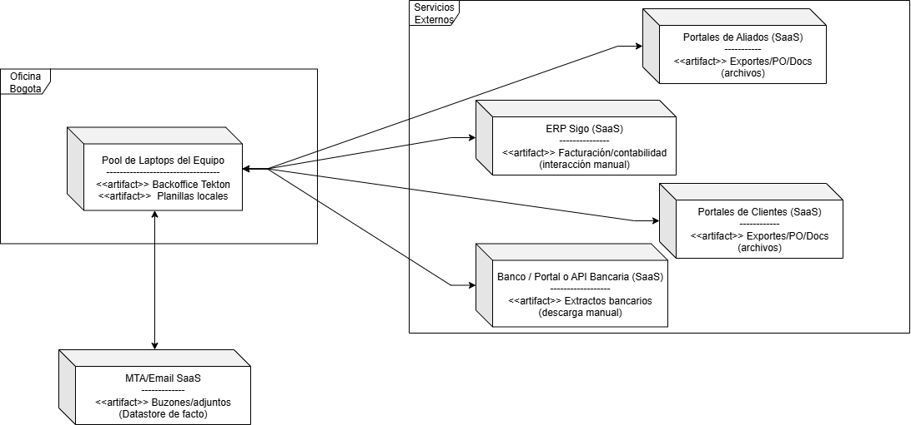

## 🔖 Nombre del Taller
_Taller 4 - Mapa de Infraestructura y Diagnóstico Técnico_

## 👥 Integrantes del equipo
- Diego Ramírez - diegorate@unisabana.edu.co  
- Carlos Sánchez - carlossanlo@unisabana.edu.co
- Mateo Vanegas - mateovaco@unisabana.edu.co

## 🧠 Descripción general del trabajo
Technologies mediante un mapa lógico que refleja cómo se despliegan y conectan los recursos que soportan sus operaciones. El objetivo del taller fue identificar, con base en el estado AS-IS de la organización, cuáles son los nodos de cómputo, servicios externos y repositorios de datos que conforman la arquitectura vigente, para posteriormente diagnosticar sus debilidades, cuellos de botella y oportunidades de mejora.

La actividad se desarrolló tomando como punto de partida los hallazgos de ejercicios previos (C1 y C2 del modelo C4) y trasladando los contenedores allí identificados hacia un esquema de despliegue realista. En este contexto, se representaron los portátiles del equipo como el núcleo de operación, los servicios SaaS externos (ERP Sigo, portales de banco, clientes y aliados) y el uso del correo electrónico como repositorio de facto de documentos. El resultado es un diagrama que evidencia la simplicidad y fragilidad de la infraestructura actual, así como su dependencia de procesos manuales y de servicios externos no integrados

## 🔧 Proceso de desarrollo
1. **Revisión de insumos previos:** Se analizaron los entregables del taller anterior (diagramas C1 y C2) para identificar los actores, contenedores y flujos de información críticos que debían trasladarse a un nivel de infraestructura. Esto permitió establecer qué debía representarse como nodo lógico o físico y qué debía modelarse como servicio externo.

2. **Identificación de nodos principales:** Se decidió agrupar los recursos de cómputo internos en un único *pool de laptops del equipo*, ya que Tekton no cuenta con servidores dedicados ni infraestructura centralizada. También se incluyeron explícitamente los servicios SaaS con los que la empresa interactúa (ERP Sigo, portales de clientes y aliados, portal bancario y MTA de correo).

3. **Asignación de artefactos a nodos:** A cada nodo se le asoció la funcionalidad o repositorio que actualmente soporta. En los portátiles se ubicó el *Backoffice Tekton* (procesos manuales de ofimática y correo) y las *planillas locales*. En el servicio de correo se señaló el datastore de buzones y adjuntos, considerado repositorio de facto.

4. **Definición de conexiones:** Se trazaron las relaciones de uso entre los nodos, especificando los protocolos o medios de interacción más frecuentes (SMTP/IMAP/HTTPS para correo, descargas manuales de extractos bancarios, portales web para facturación y conciliación, intercambio de archivos vía email).

5. **Iteración y simplificación:** Se realizaron varios ajustes para evitar sobrecargar el diagrama. En lugar de modelar cada portátil individualmente, se representó un único nodo con multiplicidad. De igual forma, se agruparon todos los servicios externos bajo un boundary común. Esto mantuvo el mapa comprensible y al mismo tiempo realista.

6. **Herramientas utilizadas:** El modelado se llevó a cabo en *draw.io*, manteniendo la notación UML de despliegue y siguiendo las prácticas de C4-Deployment para expresar nodos, artefactos y límites de sistema. La documentación se preparó en Markdown para facilitar la colaboración y el control de versiones.

Herramientas: **draw.io** para diagramas y Markdown para documentación colaborativa.

## 🧩 Análisis del modelo propuesto

### Cómo se estructura el modelo entregado
El modelo se organiza en tres agrupaciones principales: la **Oficina Bogotá**, donde se encuentra el pool de laptops del equipo con los artefactos Backoffice Tekton y planillas locales; el **Proveedor de Correo SaaS**, que actúa como repositorio de facto para documentos y adjuntos; y los **Servicios Externos**, que incluyen ERP Sigo, portales bancarios, portales de clientes y portales de aliados. Las conexiones se describen con los medios de interacción predominantes (correo electrónico, descargas manuales, portales web), reflejando el carácter manual y descentralizado de la infraestructura. 

### Cómo representa las necesidades del cliente
El modelo refleja con fidelidad el estado actual de Tekton, evidenciando que la operación depende de un conjunto limitado de laptops personales, del correo electrónico como canal principal y de servicios SaaS sin integración formal. Esta representación permite entender por qué la empresa enfrenta problemas de trazabilidad, control y estandarización: no existe un CRM ni un repositorio central, la conciliación se realiza con planillas, y la facturación se gestiona manualmente a través de portales. El mapa deja en claro las carencias de la infraestructura actual frente a los objetivos estratégicos de Tekton (centralización, automatización, visibilidad operativa).

### Supuestos tomados
- Se asumió que el **pool de laptops** representa a todos los empleados y que en ellos conviven tanto funciones administrativas como operativas.  
- Se modeló el **correo electrónico** como un nodo SaaS independiente con datastore, dado que allí se concentra la mayoría de los documentos críticos.  
- Se consideró que los **servicios externos (ERP Sigo, bancos, portales)** se consumen exclusivamente vía portales web, sin integración API nativa.  
- No se incluyeron otros elementos de red (firewall, switches) por no tener evidencia en los insumos, manteniendo el modelo en un nivel lógico simplificado.  

## 📈 Diagrama final entregado

- `entrega/Diagrama-Infraestructura-Tekton.drawio.png` — Diagrama Infraestructura Tekton.  

## 🔍 Investigación complementaria
### Tema investigado:
Comparación TOGAF vs C4 y aplicación de STRIDE para diagnóstico de infraestructura.

### Resumen:
Para ubicar nuestro trabajo de infraestructura dentro de marcos reconocidos, contrastamos TOGAF con C4. TOGAF es un framework de arquitectura empresarial que provee un método (ADM) y artefactos para diseñar y gobernar la arquitectura a nivel de negocio, datos, aplicaciones y tecnología; es decir, orienta el “proceso y gobierno” de la arquitectura, no la notación detallada de diagramas de software [1]. En Tekton, esto implica que la planificación de capacidades (p. ej., centralizar documentos, estandarizar facturación) podría enmarcarse en TOGAF, mientras que la representación concreta que usamos (C1/C2 y el mapa lógico/físico de despliegue) responde a una notación de software como C4 y a un Deployment/UML para infraestructura. Así, TOGAF nos da el por qué y el qué a nivel empresa; C4/UML nos dan el cómo se ve la solución en términos de sistemas, contenedores y nodos de despliegue.

En seguridad, aplicamos STRIDE como lista de verificación para el diagnóstico del diagrama de infraestructura. STRIDE clasifica amenazas en seis categorías: spoofing, tampering, repudiation, information disclosure, denial of service y elevation of privilege [2]. Con Tekton, esto guía preguntas accionables sobre el AS-IS: ¿hay riesgo de spoofing en accesos a SaaS sin MFA? (authenticity), ¿puede haber tampering de planillas locales o adjuntos de correo? (integrity), ¿existe trazabilidad para evitar repudiation en conciliaciones manuales? (non-repudiation), ¿hay information disclosure por documentos sensibles en buzones? (confidentiality), ¿un corte del MTA o del banco genera DoS operativo? (availability), y ¿puede un endpoint comprometido lograr elevation of privilege sobre cuentas SaaS? (authorization). Este enfoque conecta directamente el mapa de nodos y enlaces con controles de seguridad priorizables.
## 📚 Referencias
- [1] The Open Group, “The TOGAF® Standard – Introduction.” Available: https://www.togaf.org/chap01.html
- [2] Microsoft, “STRIDE model (Threats in the Threat Modeling Tool),” Microsoft Learn, Aug. 25, 2022. Available: https://learn.microsoft.com/en-us/azure/security/develop/threat-modeling-tool-threats

---

_Este documento hace parte de la entrega del taller 3 del curso AREM (Arquitectura Empresarial) - Universidad de La Sabana._
